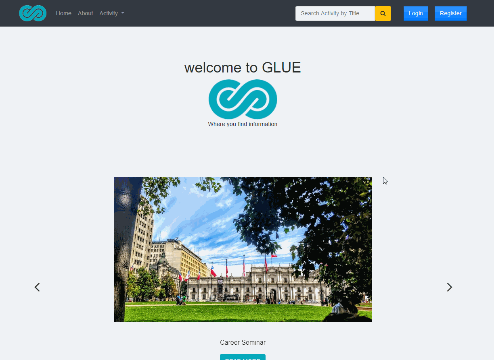

## Set up

*   `npm install`
*   `composer install`
*   copy `.env.example` to `.env` and config the mysql database
*   `php artisan migrate` or `php artisan migrate:refresh` if needed
*   `php artisan storage:link` if needed
*   `php artisan tinker` --> Generate fake data (optionally)
    *   `factory(App\User::class, 10)->create()`
    *   `factory(App\Activity::class, 10)->create()`
*   `php artisan serve`

## Preview

